# gitusage

简要介绍git的使用

## 1. git简介

### 1.1 git的诞生

由于Linux内核之前所选择的版本控制系统BitKeeper要收回Linux社区的免费使用权, Linus于是花了两周的时间用C语言写了一个分布式版本控制系统, 这就是git.

### 1.2 集中式vs分布式

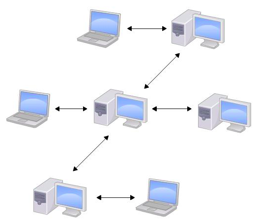

集中式版本控制系统的最大毛病就是必须联网才能工作, 如果在局域网内还好, 带宽够大, 速度够快, 可如果在互联网上, 遇到网速慢的话, 可能提交一个10M的文件就需要5分钟, 这还不得把人给憋死啊.

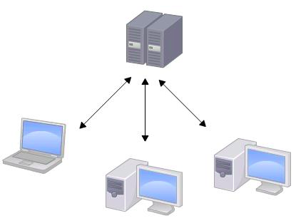

和集中式版本控制系统相比, 分布式版本控制系统的安全性要高很多, 因为每个人电脑里都有完整的版本库, 某一个人的电脑坏掉了不要紧, 随便从其他人那里复制一个就可以了. 而集中式版本控制系统的中央服务器要是出了问题, 所有人都没法干活了.

### 1.3 创建版本库

创建一个版本库非常简单, 首先, 选择一个合适的地方, 创建一个空目录:

```
$ mkdir learngit
$ cd learngit
$ pwd
/Users/michael/learngit
```

第二步, 通过`git init`命令把这个目录变成git可以管理的仓库:

```
$ git init
Initialized empty Git repository in /Users/michael/learngit/.git/
```

至此, git仓库就瞬间创建好了. 当前目录下多了一个`.git`的目录, 该目录是git用来跟踪管理版本库的.

## 2. 时光穿梭机

我们已经成功添加并提交了一个readme.txt文件, 现在, 是时候继续工作了, 于是, 我们继续修改readme.txt文件, 改成如下内容:

```
Git is a distributed version control system.
Git is free software.
```
现在, 运行`git status`命令看看结果:

```
$ git status
On branch master
Changes not staged for commit:
  (use "git add <file>..." to update what will be committed)
  (use "git checkout -- <file>..." to discard changes in working directory)

    modified:   readme.txt

no changes added to commit (use "git add" and/or "git commit -a")
```

`git status`命令可以让我们时刻掌握仓库的当前状态, 上面的命令输出告诉我们, `readme.txt`被修改过了, 但是还没有准备提交的修改.

虽然git告诉我们`readme.txt`被修改了, 但是如果能看看具体修改了什么内容, 自然是很好的. 比如你休假两周从国外回来, 第一天上班时, 已经记不清上次怎么修改的`readme.txt`, 所以, 需要`git diff`这个命令看看:

```
$ git diff readme.txt
diff --git a/readme.txt b/readme.txt
index 46d49bf..9247db6 100644
--- a/readme.txt
+++ b/readme.txt
@@ -1,2 +1,2 @@
-Git is a version control system.
+Git is a distributed version control system.
 Git is free software.
```

`git diff`顾名思义就是查看difference, 显示的格式正式Unix通用的diff格式, 可以从上面的命令输出看到, 我们在第一行添加了一个`distributed`单词.

知道了对`readme.txt`作了什么修改后, 再把它提交到仓库就放心多了, 提交修改和提交新文件是一样的两步, 第一步是`git add`:

```
$ git add readme.txt
```

同样没有任何输出. 在执行第二步`git commit`之前, 我们再运行`git status`看看当前仓库的状态:

```
$ git status
On branch master
Changed to be committed:
  (use "git reset HEAD <file>..." to unstage)

    modified:    readme.txt
```

`git status`告诉我们, 将要被提交的修改包括`readme.txt`, 下一步, 就可以放心地提交了:

```
$ git commit -m "add distributed"
[master e475afc] add distributed
 1 file changed, 1 insertion(+), 1 deletion(-)
```

提交后, 我们再用`git status`命令看看仓库的当前状态:

```
$ git status
On branch master
nothing to commit, working tree clean
```

git 告诉我们当前没有需要需要提交的修改, 而且, 工作目录是干净(working tree clean)的.

### 2.1 版本回退

现在, 你已经学会了修改文件, 然后把修改提交到git版本库, 现在, 再练习一次， 修改`readme..txt`文件如下:

```
Git is a distributed version control system.
Git is free software distributed under the GPL.
```

然后尝试提交:

```
$ git add readme.txt
$ git commit -m "append GPL"
[master 1094adb] append GPL
 1 file changed, 1 insertion(+), 1 deletion(-)
```

像这样, 你不断对文件进行修改, 然后不断提交修改到版本库里, 就好比玩RPG游戏时, 每通过一关就会自动把游戏状态存盘, 如果某一关没过去, 你还可以选择读取前一关的状态. 有些时候, 在打Boss之前, 你会手动存盘, 以便万一打Boss失败了, 可以从最近的地方重新开始. git也是一样, 每当你觉得文件修改到一定程度的时候, 就可以"保存一个快照", 这个快照在git中被称为commit. 一旦你把文件改乱了, 或者误删了文件, 还可以从最近的一个commit恢复, 然后继续工作, 而不是把几个月的工作成果全部丢失.

现在, 我们回顾一下`readme.txt`文件一共有几个版本被提交到git仓库里了:

版本1: wrote a readme file

```
Git is a version control system.
Git is free software.
```

版本2: add distributed

```
Git is a distributed version control system.
Git is free software.
```

版本3: append GPL

```
Git is a distributed version control system.
Git is free software distributed under the GPL.
```

当然了, 在实际工作中, 我们脑子里怎么可能记得一个几千行的文件每次都改了什么内容, 不然要版本管理系统干什么. 版本管理系统肯定有某个命令可以告诉我们历史记录, 在git中, 我们用`git log`命令查看:

```
$ git log
commit 1094adb7b9b3807259d8cb349e7df1d4d6477073 (HEAD -> master)
Author: Michael Liao <askxuefeng@gmail.com>
Date:   Fri May 18 21:06:15 2018 +0800

    append GPL

commit e475afc93c209a690c39c13a46716e8fa000c366
Author: Michael Liao <askxuefeng@gmail.com>
Date:   Fri May 18 21:03:36 2018 +0800

    add distributed

commit eaadf4e385e865d25c48e7ca9c8395c3f7dfaef0
Author: Michael Liao <askxuefeng@gmail.com>
Date:   Fri May 18 20:59:18 2018 +0800

    wrote a readme file
```

`git log`命令显示从最近到最远的提交日志, 我们可以看到3次提交, 最近的一次是`append GPL`, 上一次是`add distributed`, 最早的一次是`wrote a readme file`.

如果嫌输出信息太多, 看得眼花缭乱的, 可以试试加上`--pretty=oneline`参数:

```
$ git log --pretty=oneline
1094adb7b9b3807259d8cb349e7df1d4d6477073 (HEAD -> master) append GPL
e475afc93c209a690c39c13a46716e8fa000c366 add distributed
eaadf4e385e865d25c48e7ca9c8395c3f7dfaef0 wrote a readme file
```

需要友情提示的是, 你看到的一大串类似`1094adb...`的`commit id`(版本号), 和SVN不一样, git的`commit id`不是1, 2, 3......递增的数字, 而是一个SHA1计算出来的一个非常大的数字, 用十六进制表示, 而且你看到的commit id和我的肯定不一样, 以你自己的为准. 为什么`commit id`需要用这么一大串数字表示呢? 因为git是分布式的版本控制系统, 后面我们还要研究多人在同一个版本里工作, 如果大家都用1, 2, 3......作为版本号, 那肯定就冲突了.

每提交一个新的版本, 实际上git就会把它们自动串成一条线. 如果使用可视化工具查看git历史, 就可以更清楚地看到提交历史的时间线:

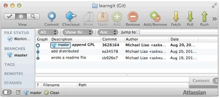

好了, 现在我们启动时光穿随机, 准备把`readme.txt`回退到上一个版本, 也就是`add distributed`的那个版本, 怎么做呢?

首先, git必须知道当前版本是哪个版本, 在git中, 用`HEAD`表示当前版本, 也就是最新的提交`1094adb...`(注意我的提交ID和你的肯定不一样), 上一个版本就是`HEAD^`, 上上一个版本就是`HEAD^^`, 当然往上100个版本写100个`^`比较容易数不过来, 所以写成`HEAD~100`.

现在, 我们要把当前版本`append GPL`会退到上一个版本`add distributed`, 就可以使用`git reset`命令:

```
$ git reset --hard HEAD^
HEAD is now at e475afc add distributed
```

`--hard`参数有啥意义? 这个后面再讲, 现在你先放心使用.

看看`readme.txt`的内容是不是版本`add distributed`:

```
$ cat readme.txt
Git is a distributed version control system.
Git is free software.
```

果然被还原了.

还可以继续会退到上一个版本`wrote a readme file`, 不过且慢, 让我们用`git log`再看看现在版本库中的状态:

```
$ git log
commit e475afc93c209a690c39c13a46716e8fa000c366 (HEAD -> master)
Author: Michael Liao <askxuefeng@gmail.com>
Date:   Fri May 18 21:03:36 2018 +0800

    add distributed

commit eaadf4e385e865d25c48e7ca9c8395c3f7dfaef0
Author: Michael Liao <askxuefeng@gmail.com>
Date:   Fri May 18 20:59:18 2018 +0800

    wrote a readme file
```

最新的那个版本`append GPL`已经看不到了! 好比你从21世纪坐时光穿梭机来到了19世纪, 想再回去已经回不去了, 肿么办?

办法其实是有的, 只要上面的命令行窗口还没有被关掉, 你就可以顺着往上找啊找啊, 找到那个`append GPL`的`commit id`是`1094adb...`, 于是就可以指定回到未来的某个版本:

```
$ git reset --hard 1094a
HEAD is now at 83b0afe append GPL
```

版本号没必要写全, 前面几位就可以了, git会自动去找. 当然也不能只写前一两位, 因为git可能会找到多个版本号, 就无法确定是哪一个了.

再小心翼翼地看看`readme.txt`的内容:

```
$ cat readme.txt
Git is a distributed version control system.
Git is free software distributed under the GPL.
```

果然, 我胡汉三又回来了.

git的版本回退速度非常快, 因为git在内部有个指向当前版本的HEAD指针, 当你回退版本的时候, git仅仅是把HEAD从指向`append GPL`:

```
┌────┐
│HEAD│
└────┘
   │
   └──> ○ append GPL
        │
        ○ add distributed
        │
        ○ wrote a readme file
```

改为指向`add distributed`:

```
┌────┐
│HEAD│
└────┘
   │
   │    ○ append GPL
   │    │
   └──> ○ add distributed
        │
        ○ wrote a readme file
```

然后顺便把工作区的文件更新了. 所以你让HEAD指向哪个版本号, 你就把当前版本定位在哪.

现在, 你回退到了某个版本, 关掉了电脑, 第二天早上就后悔了, 想恢复到新版本怎么办? 找不到新版本的commit id怎么办?

在git中, 总是有后悔药可以吃的. 当你用`$ git reset --hard HEAD^`回退到`add distributed`版本时, 再想恢复到`append GPL`, 就必须找到`append GPL`的`commit id`. git提供了一个命令`git reflog`用来记录你的每一次命令:

```
$ git reflog
e475afc HEAD@{1}: reset: moving to HEAD^
1094adb (HEAD -> master) HEAD@{2}: commit: append GPL
e475afc HEAD@{3}: commit: add distributed
eaadf4e HEAD@{4}: commit (initial): wrote a readme file
```

终于舒了口气, 从输出可知, `append GPL`的`commit id`是`1094adb`, 现在, 你又可以乘坐时光机回到未来了.

**小结**

- `HEAD`指向的版本就是当前版本, 因此, git允许我们在版本的历史之间穿梭, 使用命令`git reset --hard commit_id`.
- 穿梭前, 用`git log`可以查看提交历史, 以便确定要回退到哪个版本.
- 要重返未来, 用`git reflog`查看命令历史, 以便确定要回到未来的哪个版本.


### 2.2 工作区和暂存区

git和其他版本控制系统如SVN的一个不同之处就是暂存区的概念.

先来看看名称解释.

- 工作区(Working Directionary)

就是你在电脑里能看到的目录, 比如我的learngit文件夹就是一个工作区:

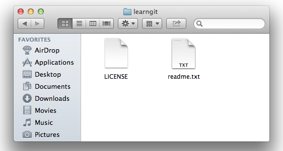

- 版本库(Repository)

工作区有一个隐藏目录`.git`, 这个不算工作区, 而是git的版本库.

git的版本库里面存了很多东西, 其中最重要的就是称为stage(或者叫index)的暂存区, 还有git为我们自动创建的第一个分支`master`, 以及指向`master`的一个指针叫`HEAD`.

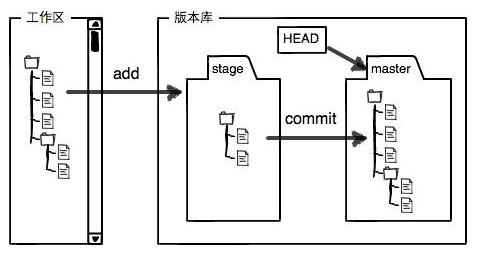

分支和`HEAD`的概念我们以后再讲.

前面讲了我们把文件往git版本库里添加的时候, 是分两步执行的:

第一步是用`git add`把文件添加进去, 实际上就是把文件修改添加到暂存区;

第二步是用`git commit`提交更改, 实际上就是把暂存区的所有内容提交到当前分支.

因为我们创建`git`版本库时, git自动为我们创建了唯一一个`master`分支, 所以, 现在`git commit`就是往`master`分支上提交更改.

你可以简单理解为, 需要提交的文件修改通通放到暂存区, 然后, 一次性提交暂存区的所有修改.

俗话说, 实践出真知. 现在, 我们再练习一遍, 先对`readme.txt`做个修改, 比如加上一行内容:

```
Git is a distributed version control system.
Git is free software distributed under the GPL.
Git has a mutable index called stage.
```
然后, 在工作区新增一个`LICENSE`文本文件(内容随便写).

先用`git status`查看一下状态:

```
$ git status
On branch master
Changes not staged for commit:
  (use "git add <file>..." to update what will be committed)
  (use "git checkout -- <file>..." to discard changes in working directory)

	modified:   readme.txt

Untracked files:
  (use "git add <file>..." to include in what will be committed)

	LICENSE

no changes added to commit (use "git add" and/or "git commit -a")
```

git非常清楚地告诉我们, `readme.txt`被修改了, 而`LICENSE`从来没有被添加过, 所以它的状态是`Untracked`.

现在, 使用两次命令`git add`, 把`readme.txt`和`LICENSE`都添加后, 用`git status`再查看一下:

```
$ git status
On branch master
Changes to be committed:
  (use "git reset HEAD <file>..." to unstage)

	new file:   LICENSE
	modified:   readme.txt
```
现在, 暂存区的状态就变成这样了:

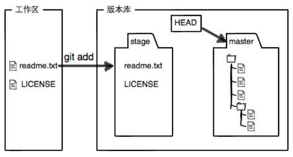

所以, `git add`命令实际上就是把要提交的所有修改放到暂存区(Stage), 然后, 执行`git commit`就可以一次性把暂存区的所有修改提交到分支.

```
$ git commit -m "understand how stage works"
[master e43a48b] understand how stage works
 2 files changed, 2 insertions(+)
 create mode 100644 LICENSE
```

一旦提交后, 如果你又没有对工作区做任何修改, 那么工作区就是"干净"的:

```
$ git status
On branch master
nothing to commit, working tree clean
```

现在版本库变成了这样, 暂存区就没有任何内容了:

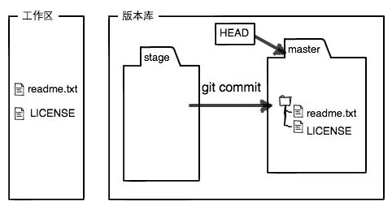

**小结**

暂存区是git非常重要的概念, 弄明白了暂存区, 就弄明白了git的很多操作到底在干什么.

### 2.3 管理修改

现在, 假定你已经完全掌握了暂存区的概念. 下面, 我们要讨论的就是, 为什么git比其他版本控制系统设计得优秀, 因为git跟踪并管理的是修改, 而非文件.

你会问, 什么是修改? 比如你新增了一行, 这就是一个修改, 删除了一行, 也是一个修改, 更改了某些字符, 也是一个修改, 删了一些又加了一些, 也是一个修改, 甚至创建一个新文件, 也算一个修改. 为什么说git管理的是修改, 而不是文件呢? 我们还是做实验. 第一步, 对readme.txt做一些修改, 比如加一行内容:

```
$ cat readme.txt
Git is a distributed version control system.
Git is free software distributed under the GPL.
Git has a mutable index called stage.
Git tracks changes.
```
然后, 添加:

```
$ git add readme.txt
$ git status
# On branch master
# Changes to be committed:
#   (use "git reset HEAD <file>..." to unstage)
#
#       modified:   readme.txt
#
```
然后, 再修改readme.txt:

```
$ cat readme.txt 
Git is a distributed version control system.
Git is free software distributed under the GPL.
Git has a mutable index called stage.
Git tracks changes of files.
```
提交:

```
$ git commit -m "git tracks changes"
[master 519219b] git tracks changes
 1 file changed, 1 insertion(+)
```
提交后, 再看看状态:

```
$ git status
On branch master
Changes not staged for commit:
  (use "git add <file>..." to update what will be committed)
  (use "git checkout -- <file>..." to discard changes in working directory)

	modified:   readme.txt

no changes added to commit (use "git add" and/or "git commit -a")
```

咦, 怎么第二次的修改没有被提交?

别激动, 我们回顾一下操作过程:

第一次修改 -> `git add` -> 第二次修改 -> `git commit`

你看, 我们前面讲了, git管理的是修改, 当你用`git add`命令后, 在工作区的第一次修改被放入暂存区, 准备提交, 但是, 在工作区的第二次修改并没有放入暂存区, 所以, `git commit`只负责把暂存区的修改提交了, 也就是第一次的修改被提交了, 第二次的修改不会被提交.

提交后, 用`git diff HEAD -- readme.txt`命令可以查看工作区和版本库里面最新版本的区别:

```
$ git diff HEAD -- readme.txt 
diff --git a/readme.txt b/readme.txt
index 76d770f..a9c5755 100644
--- a/readme.txt
+++ b/readme.txt
@@ -1,4 +1,4 @@
 Git is a distributed version control system.
 Git is free software distributed under the GPL.
 Git has a mutable index called stage.
-Git tracks changes.
+Git tracks changes of files.
```

可见, 第二次修改确实没有被提交.

那怎么提交第二次修改呢? 你可以继续`git add`再`git commit`, 也可以别着急提交第一次修改, 先`git add`第二次修改, 再`git commit`, 就相当于把两次修改合并后一块提交了:

第一次修改 -> `git add` -> 第二次修改 -> `git add` -> `git commit`

好, 现在, 把第二次修改提交了, 然后开始小结.

**小结**

现在, 你又理解了git是如何跟踪修改的, 每次修改，如果不用`git add`到暂存区, 那就不会加入到`commit`中.

### 2.4 撤销修改

自然, 你是不会犯错的. 不过现在是凌晨两点, 你正在赶一份工作报告, 你在`readme.txt`中添加了一行:

```
$ cat readme.txt
Git is a distributed version control system.
Git is free software distributed under the GPL.
Git has a mutable index called stage.
Git tracks changes of files.
My stupid boss still prefers SVN.
```

你可以发现, git会告诉你, `git checkout --file`可以丢弃工作区的修改:

```
$ git checkout -- readme.txt
```

命令`git checkout -- readme.txt`意思就是, 把`readme.txt`文件在工作区的修改全部撤销, 这里有两种情况:

一种是`readme.txt`自修改后还没有被放到暂存区, 现在, 撤销修改就回到和版本库一模一样的状态;

一种是`readme.txt`已经添加到暂存区后, 又作了修改, 现在, 撤销修改就回到添加到暂存区后的状态.

总之, 就是让这个文件回到最近一次`git commit`或`git add`时的状态.

现在, 看看`readme.txt`的文件内容:

```
$ cat readme.txt
Git is a distributed version control system.
Git is free software distributed under the GPL.
Git has a mutable index called stage.
Git tracks changes of files.
```

文件内容果然复原了.

`git checkout -- file`命令中的`--`很重要, 没有`--`, 就变成了"切换到另一个分支"的命令, 我们在后面的分支管理中会再次遇到`git checkout`命令.

现在假定是凌晨3点, 你不但写了一些胡话, 还git add到暂存区了:

```
$ cat readme.txt
Git is a distributed version control system.
Git is free software distributed under the GPL.
Git has a mutable index called stage.
Git tracks changes of files.
My stupid boss still prefers SVN.

$ git add readme.txt
```

庆幸的是, 在`commit`之前, 你发现了这个问题. 用`git status`查看一下, 修改只是添加到了暂存区, 还没有提交:

```
$ git status
On branch master
Changes to be committed:
  (use "git reset HEAD <file>..." to unstage)

	modified:   readme.txt
```

git同样告诉我们, 用命令`git reset HEAD <file>`可以把暂存区的修改撤销掉(unstage), 重新放回工作区:

```
$ git reset HEAD readme.txt
Unstaged changes after reset:
M	readme.txt
```

`git reset`命令既可以回退版本, 可把暂存区的修改回退到工作区. 当我们用HEAD时, 表示最新的版本.

再用`git status`查看一下, 现在暂存区是干净的, 工作区有修改:

```
$ git status
On branch master
Changes not staged for commit:
  (use "git add <file>..." to update what will be committed)
  (use "git checkout -- <file>..." to discard changes in working directory)

	modified:   readme.txt
```

还记得如何丢弃工作区的修改吗?

```
$ git checkout -- readme.txt

$ git status
On branch master
nothing to commit, working tree clean
```

整个世界终于清静了?

现在, 假设你不但改错了东西, 还从暂存区提交到了版本库, 怎么办呢? 还记得版本回退一节吗? 可以回退到上一个版本. 不过, 这是有条件的, 就是你还没有把自己的本地版本库推送到远程. 还记得git是分布式版本控制系统吗? 我们后面会讲到远程版本库, 一旦你把`stupid boss`提交推送到远程版本库, 你就真的惨了......

**小结**

又到了小结时间.

场景1: 当你改乱了工作区某个文件的内容, 想直接丢弃工作区的修改时, 用命令`git checkout -- file`.

场景2: 当你不但改乱了工作区某个文件的内容, 还添加到了暂存区时, 想丢弃修改, 分两步, 第一步用命令`git reset HEAD <file>`, 就回到了场景1, 第二步按场景1操作.

场景3: 已经提交了不合适的修改到版本库时, 想要撤销本次提交, 参考版本回退一节, 不过前提是没有推送到远程库.


### 2.5 删除文件

在git中, 删除也是一个修改操作, 我们实战以下, 先添加一个新文件`test.txt`到git并且提交:

```
$ git add test.txt

$ git commit -m "add test.txt"
[master b84166e] add test.txt
 1 file changed, 1 insertion(+)
 create mode 100644 test.txt
```

一般情况下, 你通常直接在文件管理器中把没用的文件删了, 或者用`rm`命令删了:

```
$ rm test.txt
```

这个时候, git知道你删除了文件, 因此, 工作区和版本库就不一致了, `git status`命令会立刻告诉你哪些文件被删除了:

```
$ git status
On branch master
Changes not staged for commit:
  (use "git add/rm <file>..." to update what will be committed)
  (use "git checkout -- <file>..." to discard changes in working directory)

	deleted:    test.txt

no changes added to commit (use "git add" and/or "git commit -a")
```

现在你有两个选择, 一是确实要从版本库中删除该文件, 那就用命令`git rm`删掉, 并且`git commit`:

```
$ git rm test.txt
rm 'test.txt'

$ git commit -m "remove test.txt"
[master d46f35e] remove test.txt
 1 file changed, 1 deletion(-)
 delete mode 100644 test.txt
```

现在, 文件就从版本库中被删除了.

> 小提示: 先手动删除文件, 然后使用git rm <file>和git add <file>效果是一样的.

另一种情况是删错了, 因为版本库里面还有呢, 所以可以很轻松地把误删的文件恢复到最新版本:

```
$ git checkout -- test.txt
```

`git checkout`其实是用版本库里的版本替换工作区的版本, 无论工作区是修改还是删除, 都可以"一键还原".

> 注意: 从来没有被添加到版本库就被删除的文件, 是无法恢复的!

**小结**

命令`git rm`用于删除一个文件. 如果一个文件已经被提交到版本库, 那么你永远不用担心误删, 但是要小心, 你只能恢复文件到最新版本, 你会丢失**最近一次提交后你修改的内容**.


## 3. 远程仓库

到目前为止, 我们已经掌握了如何在git仓库里对一个文件进行时光穿梭, 你再也不用担心文件备份或者丢失的问题了.

可是有用过集中式版本控制系统SVN的童鞋会站出来说, 这些功能在SVN里早就有了, 没看出git有什么特别的地方.

没错, 如果只是在一个仓库里管理文件历史, git和SVN真没啥区别. 为了保证你现在所学的git物超所值, 将来绝对不会后悔, 同时为了打击已经不幸学了SVN的童鞋, 本章开始介绍git的杀手级功能之一(注意是之一, 也就是后面还有之二, 之三......): 远程仓库.

git是分布式版本控制系统, 同一个git仓库, 可以分布到不同的机器上. 怎么分布呢? 最早, 肯定只有一台机器有一个原始版本库, 此后, 别的机器可以"克隆"这个原始版本库, 而且每台机器的版本库其实都是一样的, 并没有主次之分.

你肯定会想, 至少需要两台机器才能玩远程库不是? 但是我只有一台电脑, 怎么玩?

其实一台电脑上也是可以克隆多个版本库的, 只要不在同一个目录下. 不过, 现实生活中是不会有人这么傻的在一台电脑上搞几个远程库玩, 因为一台电脑上搞几个远程库完全没有意义, 而且硬盘挂了会导致所有库都挂掉, 所以我也不告诉你在一台电脑上怎么克隆多个仓库.

实际情况往往是这样, 找一台电脑充当服务器的角色, 每天24小时开机, 其他每个人都从这个"服务器"仓库克隆一份到自己的电脑上, 并且各自把各自的提交推送到服务器仓库里, 也从服务器仓库中拉取别人的提交.

完全可以自己搭建一台运行git的服务器, 不过现阶段, 为了学git先搭个服务器绝对是小题大作. 好在这个世界上有个叫gitHub的神奇的网站, 从名字就可以看出, 这个网站就是提供git仓库托管服务的, 所以, 只要注册一个gitHub账号, 就可以免费获得git远程仓库.

在继续阅读后续内容前, 请自行注册GitHub账号. 由于你的本地git仓库和gitHub仓库之间的传输是通过SSH加密的, 所以, 需要一点设置:

第1步: 创建SSH Key. 在用户主目录下, 看看有没有.ssh目录, 如果有, 再看看这个目录下有没有`id_rsa`和`id_rsa.pub`这两个文件, 如果已经有了, 可直接跳到下一步. 如果没有, 打开Shell(Windows下打开Git Bash), 创建SSH Key:

```
ssh-keygen -t rsa -C "youremail@example.com"
```

你需要把邮件地址换成你自己的邮件地址, 然后一路回车, 使用默认值即可, 由于这个Key也不是用于军事目的, 所以也无需设置密码.

如果一切顺利的话, 可以在用户主目录里找到.ssh目录, 里面有`id_rsa`和`id_rsa.pub`两个文件, 这两个就是SSH Key的秘钥对, `id_rsa`是私钥, 不能泄露出去, `id_rsa.pub`是公钥, 可以放心地告诉任何人.

第2步: 登陆gitHub, 打开"Account settings", "SSH Keys"页面:

然后, 点"Add SSH Key", 填上任意Title, 在Key文本框里粘贴`id_rsa.pub`文件的内容:

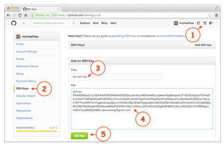

点"Add Key", 你就应该看到已经添加的Key:

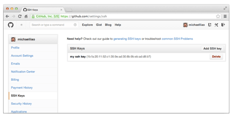

为什么gitHub需要SSH Key呢? 因为gitHub需要识别出你推送的提交确实是你推送的, 而不是别人冒充的, 而git支持SSH协议, 所以, gitHub只要知道了你的公钥, 就可以确认只有你自己才能推送.

当然, gitHub允许你添加多个Key. 假定你有若干电脑, 你一会儿在公司提交, 一会儿在家里提交, 只要把每台电脑的Key都添加到gitHub, 就可以在每台电脑上往gitHub推送了.

最后友情提示, 在gitHub上免费托管的Git仓库, 任何人都可以看到喔(但只有你自己才能改). 所以, 不要把敏感信息放进去.

如果你不想让别人看到git库, 有两个办法, 一个是交点保护费, 让gitHub把公开的仓库变成私有的, 这样别人就看不见了(不可读更不可写). 另一个办法是自己动手, 搭一个git服务器, 因为是你自己的git服务器, 所以别人也是看不见的. 这个方法我们后面会讲到的, 相当简单, 公司内部开发必备.

确保你拥有一个gitHub账号后, 我们就即将开始远程仓库的学习.

**小结**

"有了远程仓库, 妈妈再也不用担心我的硬盘了. "——git点读机

### 3.1 添加远程库

现在的情景是, 你已经在本地创建了一个git仓库后, 又想在gitHub创建一个git仓库, 并且让这两个仓库进行远程同步, 这样, gitHub上的仓库既可以作为备份, 又可以让其他人通过该仓库来协作, 真是一举多得.

首先, 登陆gitHub, 然后, 在右上角找到"Create a new repo"按钮, 创建一个新的仓库:

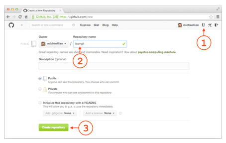

在Repository name填入`learngit`, 其他保持默认设置, 点击"Create repository"按钮, 就成功地创建了一个新的git仓库:

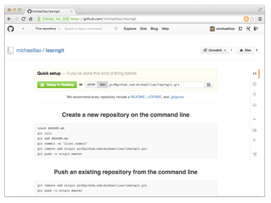

目前, 在gitHub上的这个`learngit`仓库还是空的, gitHub告诉我们, 可以从这个仓库克隆出新的仓库, 也可以把一个已有的本地仓库与之关联, 然后, 把本地仓库的内容推送到gitHub仓库.

现在，我们根据gitHub的提示，在本地的learngit仓库下运行命令:

```
$ git remote add origin git@github.com:michaelliao/learngit.git
```

请千万注意, 把上面的`michaelliao`替换成你自己的gitHub账户名, 否则, 你在本地关联的就是我的远程库, 关联没有问题, 但是你以后推送是推不上去的, 因为你的SSH Key公钥不在我的账户列表中.

添加后, 远程库的名字就是`origin`, 这是git默认的叫法, 也可以改成别的, 但是`origin`这个名字一看就知道是远程库.

下一步, 就可以把本地库的所有内容推送到远程库上:

```
$ git push -u origin master
Counting objects: 20, done.
Delta compression using up to 4 threads.
Compressing objects: 100% (15/15), done.
Writing objects: 100% (20/20), 1.64 KiB | 560.00 KiB/s, done.
Total 20 (delta 5), reused 0 (delta 0)
remote: Resolving deltas: 100% (5/5), done.
To github.com:michaelliao/learngit.git
 * [new branch]      master -> master
Branch 'master' set up to track remote branch 'master' from 'origin'.
```

把本地库的内容推送到远程, 用`git push`命令, 实际上是把当前分支`master`推送到远程.

由于远程库是空的, 我们第一次推送`master`分支时, 加上了`-u`参数, git不但会把本地的`master`分支内容推送的远程新的`master`分支, 还会把本地的`master`分支和远程的`master`分支关联起来, 在以后的推送或者拉取时就可以简化命令.

推送成功后, 可以立刻在gitHub页面中看到远程库的内容已经和本地一模一样:

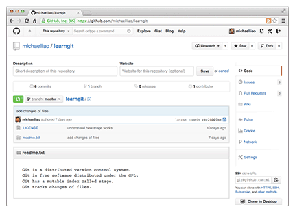

从现在起, 只要本地作了提交, 就可以通过命令:

```
$ git push origin master
```

把本地`master`分支的最新修改推送至gitHub, 现在, 你就拥有了真正的分布式版本库!

**SSH警告**

当你第一次使用git的clone或者push命令连接gitHub时, 会得到一个警告:

```
The authenticity of host 'github.com (xx.xx.xx.xx)' can't be established.
RSA key fingerprint is xx.xx.xx.xx.xx.
Are you sure you want to continue connecting (yes/no)?
```

这是因为git使用SSH连接, 而SSH连接在第一次验证gitHub服务器的Key时, 需要你确认gitHub的Key的指纹信息是否真的来自gitHub的服务器, 输入`yes`回车即可.

git会输出一个警告, 告诉你已经把gitHub的Key添加到本机的一个信任列表里了:

```
Warning: Permanently added 'github.com' (RSA) to the list of known hosts.
```

这个警告只会出现一次, 后面的操作就不会有任何警告了.

如果你实在担心有人冒充gitHub服务器, 输入`yes`前可以对照gitHub的RSA Key的指纹信息是否与SSH连接给出的一致.

**小结**

要关联一个远程库, 使用命令`git remote add origin git@server-name:path/repo-name.git`;

关联后, 使用命令`git push -u origin master`第一次推送`master`分支的所有内容;

此后, 每次本地提交后, 只要有必要, 就可以使用命令`git push origin master`推送最新修改;

分布式版本系统的最大好处之一是在本地工作完全不需要考虑远程库的存在, 也就是有没有联网都可以正常工作, 而SVN在没有联网的时候是拒绝干活的! 当有网络的时候, 再把本地提交推送一下就完成了同步, 真是太方便了!

### 从远程仓库克隆

上次我们讲了先有本地仓库, 后有远程仓库, 如何关联远程仓库.

现在, 假设我们从零开发, 那么最好的方式是先创建远程库, 然后, 从远程库克隆.

首先, 登陆gitHub, 创建一个新的仓库, 名字叫`gitskills`:

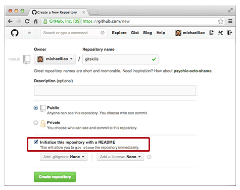

我们勾选`Initialize this repository with a README`, 这样gitHub会自动为我们创建一个`README.md`文件. 创建完毕后, 可以看到`README.md`文件:

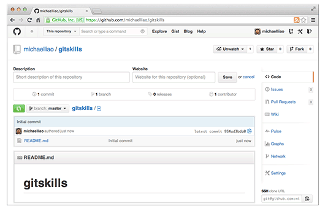

现在, 远程库已经准备好了, 下一步是用命令`git clone`克隆一个本地库:

```
$ git clone git@github.com:michaelliao/gitskills.git
Cloning into 'gitskills'...
remote: Counting objects: 3, done.
remote: Total 3 (delta 0), reused 0 (delta 0), pack-reused 3
Receiving objects: 100% (3/3), done.
```

注意把git库的地址换成你自己的, 然后进入`gitskills`目录看看, 已经有`README.md`文件了:

```
$ cd gitskills
$ ls
README.md
```

如果有多个人协作开发, 那么每个人各自从远程克隆一份就可以了.

你也许还注意到, gitHub给出的地址不止一个, 还可以用`https://github.com/michaelliao/gitskills.git`这样的地址. 实际上, git支持多种协议, 默认的`git://`使用ssh, 但也可以使用`https`等其他协议.

使用`https`除了速度慢以外, 还有个最大的麻烦是每次推送都必须输入口令, 但是在某些只开放http端口的公司内部就无法使用`ssh`协议而只能用`https`.

**小结**

要克隆一个仓库, 首先必须知道仓库的地址, 然后使用`git clone`命令克隆.

git支持多种协议, 包括`https`, 但通过`ssh`支持的原生`git`协议速度最快.


## 4. 分支管理

分支就是科幻电影里面的平行宇宙, 当你正在电脑前努力学习git的时候, 另一个你正在另一个平行宇宙里努力学习SVN.

如果两个平行宇宙互不干扰, 那对现在的你也没啥影响. 不过, 在某个时间点, 两个平行宇宙合并了, 结果, 你既学会了git又学会了SVN!


分支在实际中有什么用呢? 假设你准备开发一个新功能, 但是需要两周才能完成, 第一周你写了50%的代码, 如果立刻提交, 由于代码还没写完, 不完整的代码库会导致别人不能干活了. 如果等代码全部写完再一次提交, 又存在丢失每天进度的巨大风险.

现在有了分支, 就不用怕了. 你创建了一个属于你自己的分支, 别人看不到, 还继续在原来的分支上正常工作, 而你在自己的分支上干活, 想提交就提交, 直到开发完毕后, 再一次性合并到原来的分支上, 这样, 既安全, 又不影响别人工作.

其他版本控制系统如SVN等都有分支管理, 但是用过之后你会发现, 这些版本控制系统创建和切换分支比蜗牛还慢, 简直让人无法忍受, 结果分支功能成了摆设, 大家都不去用.

但git的分支是与众不同的, 无论创建、切换和删除分支, git在1秒钟之内就能完成! 无论你的版本库是1个文件还是1万个文件.

### 4.1 创建与合并分支

在版本回退里, 我们已经知道, 每次提交, git都会把它们串成一条时间线, 这条时间线就是一个分支, 截止到目前, 只有一条时间线, 在git里, 这个分支叫做主分支, 即`master`分支. `HEAD`严格来说不是指向提交, 而是指向`master`, `master`才是指向提交的, 所以, `HEAD`指向的就是当前分支.

一开始的时候, `master`分支是一条线, git用`master`指向最新的提交, 再用`HEAD`指向`master`, 就能确定当前分支, 以及当前分支的提交点:

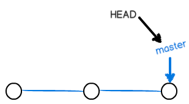

每次提交, `master`分支都会向前移动一步, 这样, 随着你不断提交, `master`分支的线也越来越长.

当我们创建新的分支, 例如`dev`时, git新建了一个指针叫`dev`, 指向`master`相同的提交, 再把`HEAD`指向`dev`, 就表示当前分支在`dev`上:

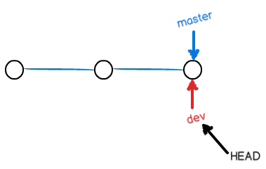

你看, git创建一个分支很快, 因为除了增加一个`dev`指针, 改改`HEAD`的指向, 工作区的文件都没有任何变化!

不过, 从现在开始, 对工作区的修改和提交就是针对`dev`分支了, 比如新提交一次后, `dev`指针往前移动一步, 而`master`指针不变:

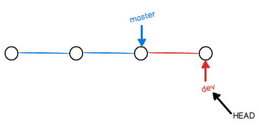

假如我们在`dev`上的工作完成了, 就可以把`dev`合并到`master`上. git怎么合并呢? 最简单的方法, 就是直接把`master`指向`dev`的当前提交, 就完成了合并:

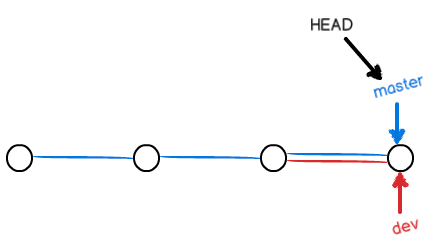

所以Git合并分支也很快！就改改指针，工作区内容也不变！

合并完分支后, 甚至可以删除`dev`分支. 删除`dev`分支就是把`dev`指针给删掉, 删掉后, 我们就剩下了一条`master`分支:

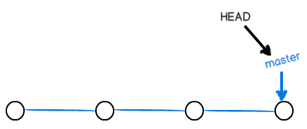

真是太神奇了, 你看得出来有些提交是通过分支完成的吗?

下面开始实战.

首先, 我们创建`dev`分支, 然后切换到`dev`分支:

```
$ git checkout -b dev
Switched to a new branch 'dev'
```

`git checkout`命令加上`-b`参数表示创建并切换, 相当于以下两条命令:'

```
$ git branch dev
$ git checkout dev
Switched to branch 'dev'
```

然后, 用`git branch`命令查看当前分支:

```
$ git branch
* dev
  master
```

`git branch`命令会列出所有分支, 当前分支前面会标一个`*`号.

然后, 我们就可以在`dev`分支上正常提交, 比如对`readme.txt`做个修改, 加上一行:

```
Creating a new branch is quick.
```

然后提交:

```
$ git add readme.txt 
$ git commit -m "branch test"
[dev b17d20e] branch test
 1 file changed, 1 insertion(+)
```

现在, `dev`分支的工作完成, 我们就可以切换回`master`分支:

```
$ git checkout master
Switched to branch 'master'
```

切换回`master`分支后, 再查看一个`readme.txt`文件, 刚才添加的内容不见了! 因为那个提交是在`dev`分支上, 而`master`分支此刻的提交点并没有变:

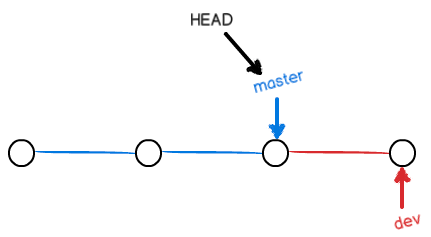

现在, 我们把`dev`分支的工作成果合并到`master`分支上:

```
$ git merge dev
Updating d46f35e..b17d20e
Fast-forward
 readme.txt | 1 +
 1 file changed, 1 insertion(+)
```

`git merge`命令用于合并指定分支到当前分支. 合并后, 再查看`readme.txt`的内容, 就可以看到, 和`dev`分支的最新提交是完全一样的.

注意到上面的`Fast-forward`信息, git告诉我们, 这次合并是"快进模式"，也就是直接把`master`指向`dev`的当前提交, 所以合并速度非常快.

当然, 也不是每次合并都能`Fast-forward`, 我们后面会讲其他方式的合并.

合并完成后, 就可以放心地删除`dev`分支了:

```
$ git branch -d dev
Deleted branch dev (was b17d20e).
```

删除后, 查看`branch`, 就只剩下`master`分支了:

```
$ git branch
* master
```

因为创建、合并和删除分支非常快, 所以git鼓励你使用分支完成某个任务, 合并后再删掉分支, 这和直接在`master`分支上工作效果是一样的, 但过程更安全.

switch

我们注意到切换分支使用`git checkout <branch>`, 而前面讲过的撤销修改则是`git checkout -- <file>`, 同一个命令, 有两种作用, 确实有点令人迷惑.

实际上, 切换分支这个动作, 用`switch`更科学. 因此, 最新版本的git提供了新的`git switch`命令来切换分支:

创建并切换到新的`dev`分支, 可以使用:

```
$ git switch -c dev
```

直接切换到已有的`master`分支, 可以使用:

```
$ git switch master
```

使用新的`git switch`命令, 比`git checkout`要更容易理解.

**小结**

git鼓励大量使用分支:

- 查看分支: `git branch`

- 创建分支: `git branch <name>`

- 切换分支: `git checkout <name>`或者`git switch <name>`

- 创建+切换分支: `git checkout -b <name>`或者`git switch -c <name>`

- 合并某分支到当前分支: `git merge <name>`

- 删除分支: `git branch -d <name>`

### 4.2 解决冲突

人生不如意之事十之八九, 合并分支往往也不是一帆风顺的.

准备新的`feature1`分支, 继续我们的新分支开发:

```
$ git switch -c feature1
Switched to a new branch 'feature1'
```

修改`readme.txt`最后一行, 改为:

```
Creating a new branch is quick AND simple.
```

在`feature1`分支上提交:

```
$ git add readme.txt

$ git commit -m "AND simple"
[feature1 14096d0] AND simple
 1 file changed, 1 insertion(+), 1 deletion(-)
```

切换到`master`分支:

```
$ git switch master
Switched to branch 'master'
Your branch is ahead of 'origin/master' by 1 commit.
  (use "git push" to publish your local commits)
```

git还会自动提示我们当前`master`分支比远程的`master`分支要超前1个提交.

在`master`分支上把`readme.txt`文件的最后一行改为:

```
Creating a new branch is quick & simple.
```

提交:

```
$ git add readme.txt 
$ git commit -m "& simple"
[master 5dc6824] & simple
 1 file changed, 1 insertion(+), 1 deletion(-)
```

现在, `master`分支和`feature1`分支各自都分别有新的提交, 变成了这样:

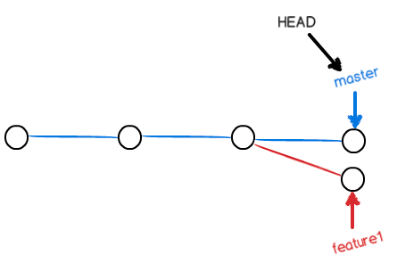

这种情况下, git无法执行"快速合并", 只能试图把各自的修改合并起来, 但这种合并就可能会有冲突, 我们试试看:

```
$ git merge feature1
Auto-merging readme.txt
CONFLICT (content): Merge conflict in readme.txt
Automatic merge failed; fix conflicts and then commit the result.
```

果然冲突了! git告诉我们, `readme.txt`文件存在冲突, 必须手动解决冲突后再提交. `git status`也可以告诉我们冲突的文件:

```
$ git status
On branch master
Your branch is ahead of 'origin/master' by 2 commits.
  (use "git push" to publish your local commits)

You have unmerged paths.
  (fix conflicts and run "git commit")
  (use "git merge --abort" to abort the merge)

Unmerged paths:
  (use "git add <file>..." to mark resolution)

	both modified:   readme.txt

no changes added to commit (use "git add" and/or "git commit -a")
```

我们可以直接查看`readme.txt`的内容:

```
Git is a distributed version control system.
Git is free software distributed under the GPL.
Git has a mutable index called stage.
Git tracks changes of files.
<<<<<<< HEAD
Creating a new branch is quick & simple.
=======
Creating a new branch is quick AND simple.
>>>>>>> feature1
```

git用`<<<<<<<`, `=======`, `>>>>>>>`标记出不同分支的内容, 我们修改如下后保存:

```
Creating a new branch is quick and simple.
```

再提交:

```
$ git add readme.txt 
$ git commit -m "conflict fixed"
[master cf810e4] conflict fixed
```

现在, `master`分支和`feature1`分支变成了下图所示:

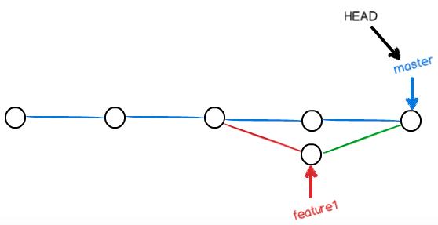

用带参数的`git log`也可以看到分支的合并情况:

```
$ git log --graph --pretty=oneline --abbrev-commit
*   cf810e4 (HEAD -> master) conflict fixed
|\
| * 14096d0 (feature1) AND simple
* | 5dc6824 & simple
|/
* b17d20e branch test
* d46f35e (origin/master) remove test.txt
* b84166e add test.txt
* 519219b git tracks changes
* e43a48b understand how stage works
* 1094adb append GPL
* e475afc add distributed
* eaadf4e wrote a readme file
```

最后, 删除`feature1`分支:

```
$ git branch -d feature1
Deleted branch feature1 (was 14096d0).
```

工作完成.


**小结**

当git无法自动合并分支时, 就必须首先解决冲突. 解决冲突后, 再提交, 合并完成.

解决冲突就是把git合并失败的文件手动编辑为我们希望的内容, 再提交.

用`git log --graph`命令可以看到分支合并图.

### 4.3 分支管理策略

通常, 合并分支时, 如果可能, git会用`fast forward`模式, 但是这种模式下, 删除分支后, 会丢失分支信息.

如果要强制禁用`Fast forward`模式, git就会在`merge`时生成一个新的`commit`, 这样, 从分支历史上就可以看出分支信息.

下面我们实战一下`--no-ff`方式的`git merge`:

首先, 仍然创建并切换`dev`分支:

```
$ git switch -c dev
Switched to a new branch 'dev'
```
修改`readme.txt`文件, 并提交一个新的`commit`:

```
$ git add readme.txt 
$ git commit -m "add merge"
[dev f52c633] add merge
 1 file changed, 1 insertion(+)
```

现在, 我们切换回`master`:

```
$ git switch master
Switched to branch 'master'
```
准备合并`dev`分支, 请注意`--no-ff`参数, 表示禁用`Fast forward`:

```
$ git merge --no-ff -m "merge with no-ff" dev
Merge made by the 'recursive' strategy.
 readme.txt | 1 +
 1 file changed, 1 insertion(+)
```

因为本次合并要创建一个新的`commit`, 所以加上`-m`参数, 把`commit`描述写进去.

合并后, 我们用`git log`看看分支历史:

```
$ git log --graph --pretty=oneline --abbrev-commit
*   e1e9c68 (HEAD -> master) merge with no-ff
|\
| * f52c633 (dev) add merge
|/
*   cf810e4 conflict fixed
...
```

可以看到, 不使用`Fast forward`模式, `merge`后就像这样:


**分支策略**

在实际开发中, 我们应该按照几个基本原则进行分支管理:

首先, `master`分支应该是非常稳定的, 也就是仅用来发布新版本, 平时不能在上面干活;

那在哪干活呢? 干活都在`dev`分支上, 也就是说, `dev`分支是不稳定的, 到某个时候, 比如1.0版本发布时, 再把`dev`分支合并到`master`上, 在`master`分支发布1.0版本;

你和你的小伙伴们每个人都在`dev`分支上干活, 每个人都有自己的分支, 时不时地往`dev`分支上合并就可以了.

所以, 团队合作的分支看起来就像这样:

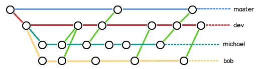

**小结**

git分支十分强大, 在团队开发中应该充分利用.

合并分支时, 加上`--no-ff`参数就可以用普通模式合并, 合并后的历史有分支, 能看出来曾经做过合并, 而`fast forward`合并就看不出来曾经做过合并.

### 4.4 Bug分支

软件开发中, bug就像家常便饭一样. 有了bug就需要修复, 在git中, 由于分支是如此的强大, 所以, 每个bug都可以通过一个新的临时分支来修复, 修复后, 合并分支, 然后将临时分支删除.

当你接到一个修复一个代号101的bug的任务时, 很自然地, 你想创建一个分支issue-101来修复它, 但是, 等等, 当前正在dev上进行的工作还没有提交:

```
$ git status
On branch dev
Changes to be committed:
  (use "git reset HEAD <file>..." to unstage)

	new file:   hello.py

Changes not staged for commit:
  (use "git add <file>..." to update what will be committed)
  (use "git checkout -- <file>..." to discard changes in working directory)

	modified:   readme.txt
```

并不是你不想提交, 而是工作只进行到一半, 还没法提交, 预计完成还需1天时间. 但是, 必须在两个小时内修复该bug, 怎么办?

幸好, git还提供了一个`stash`功能, 可以把当前工作现场"储藏"起来, 等以后恢复现场后继续工作:

```
$ git stash
Saved working directory and index state WIP on dev: f52c633 add merge
```

现在, 用`git status`查看工作区, 就是干净的(除非有没有被git管理的文件), 因此可以放心地创建分支来修复bug.

首先确定要在哪个分支上修复bug, 假定需要在master分支上修复, 就从master创建临时分支:

```
$ git checkout master
Switched to branch 'master'
Your branch is ahead of 'origin/master' by 6 commits.
  (use "git push" to publish your local commits)

$ git checkout -b issue-101
Switched to a new branch 'issue-101'
```

现在修复bug, 需要把"Git is free software ..."改为"Git is a free software ...", 然后提交:

```
$ git add readme.txt 
$ git commit -m "fix bug 101"
[issue-101 4c805e2] fix bug 101
 1 file changed, 1 insertion(+), 1 deletion(-)
```

修复完成后, 切换到master分支, 并完成合并, 最后删除`issue-101`分支:

```
$ git switch master
Switched to branch 'master'
Your branch is ahead of 'origin/master' by 6 commits.
  (use "git push" to publish your local commits)

$ git merge --no-ff -m "merged bug fix 101" issue-101
Merge made by the 'recursive' strategy.
 readme.txt | 2 +-
 1 file changed, 1 insertion(+), 1 deletion(-)
```

太棒了, 原计划两个小时的bug修复只花了5分钟! 现在, 是时候接着回到`dev`分支干活了!

```
$ git switch dev
Switched to branch 'dev'

$ git status
On branch dev
nothing to commit, working tree clean
```

工作区是干净的, 刚才的工作现场存到哪去了? 用`git stash list`命令看看:

```
$ git stash list
stash@{0}: WIP on dev: f52c633 add merge
```

工作现场还在, git把stash内容存在某个地方了, 但是需要恢复一下, 有两个办法:

一是用`git stash apply`恢复, 但是恢复后, stash内容并不删除, 你需要用`git stash drop`来删除;

另一种方式是用`git stash pop`, 恢复的同时把stash内容也删了:

```
$ git stash pop
On branch dev
Changes to be committed:
  (use "git reset HEAD <file>..." to unstage)

	new file:   hello.py

Changes not staged for commit:
  (use "git add <file>..." to update what will be committed)
  (use "git checkout -- <file>..." to discard changes in working directory)

	modified:   readme.txt

Dropped refs/stash@{0} (5d677e2ee266f39ea296182fb2354265b91b3b2a)
```

再用`git stash list`查看, 就看不到任何stash内容了:

```
$ git stash list
```

你可以多次stash, 恢复的时候, 先用`git stash list`查看, 然后恢复指定的stash, 用命令:

```
$ git stash apply stash@{0}
```

在`master`分支上修复了bug后, 我们要想一想, `dev`分支是早期从`master`分支分出来的, 所以, 这个bug其实在当前`dev`分支上也存在.

那怎么在`dev`分支上修复同样的bug? 重复操作一次, 提交不就行了?

有木有更简单的方法?

有!

同样的bug, 要在`dev`上修复, 我们只需要把`4c805e2 fix bug 101`这个提交所做的修改"复制"到`dev`分支. 注意: 我们只想复制`4c805e2 fix bug 101`这个提交所做的修改, 并不是把整个`master`分支`merge`过来.

为了方便操作, git专门提供了一个`cherry-pick`命令, 让我们能复制一个特定的提交到当前分支:

```
$ git branch
* dev
  master
$ git cherry-pick 4c805e2
[master 1d4b803] fix bug 101
 1 file changed, 1 insertion(+), 1 deletion(-)
```

git自动给`dev`分支做了一次提交, 注意这次提交的`commit`是`1d4b803`, 它并不同于`master`的`4c805e2`, 因为这两个commit只是改动相同, 但确实是两个不同的commit. 用`git cherry-pick`, 我们就不需要在dev分支上手动再把修bug的过程重复一遍.

有些聪明的童鞋会想了, 既然可以在`master`分支上修复bug后, 在`dev`分支上可以"重放"这个修复过程, 那么直接在dev分支上修复bug, 然后在`master`分支上"重放"行不行? 当然可以, 不过你仍然需要`git stash`命令保存现场, 才能从`dev`分支切换到`master`分支.

**小结**

修复bug时, 我们会通过创建新的bug分支进行修复, 然后合并, 最后删除;

当手头工作没有完成时, 先把工作现场`git stash`一下, 然后去修复bug, 修复后, 再`git stash pop`, 回到工作现场;

在`master`分支上修复的bug, 想要合并到当前`dev`分支, 可以用`git cherry-pick <commit>`命令, 把bug提交的修改"复制"到当前分支, 避免重复劳动.

### 4.5 Feature分支

软件开发中, 总有无穷无尽的新的功能要不断添加进来.

添加一个新功能时, 你肯定不希望因为一些实验性质的代码, 把主分支搞乱了, 所以, 每添加一个新功能, 最好新建一个`feature`分支, 在上面开发, 完成后, 合并, 最后, 删除该`feature`分支.

现在, 你终于接到了一个新任务: 开发代号为Vulcan的新功能, 该功能计划用于下一代星际飞船.

于是准备开发:

```
$ git switch -c feature-vulcan
Switched to a new branch 'feature-vulcan'
```

5分钟后, 开发完毕:

```
$ git add vulcan.py

$ git status
On branch feature-vulcan
Changes to be committed:
  (use "git reset HEAD <file>..." to unstage)

	new file:   vulcan.py

$ git commit -m "add feature vulcan"
[feature-vulcan 287773e] add feature vulcan
 1 file changed, 2 insertions(+)
 create mode 100644 vulcan.py
```

切回`dev`, 准备合并:

```
$ git switch dev
```

一切顺利的话, `feature`分支和`bug`分支是类似的, 合并, 然后删除.

但是!

就在此时, 接到上级命令, 因经费不足, 新功能必须取消!

虽然白干了, 但是这个包含机密资料的分支还是必须就地销毁:

```
$ git branch -d feature-vulcan
error: The branch 'feature-vulcan' is not fully merged.
If you are sure you want to delete it, run 'git branch -D feature-vulcan'.
```

销毁失败. git友情提醒, `feature-vulcan`分支还没有被合并, 如果删除, 将丢失掉修改, 如果要强行删除, 需要使用大写的`-D`参数.

现在我们强行删除:

```
$ git branch -D feature-vulcan
Deleted branch feature-vulcan (was 287773e).
```

终于删除成功!

**小结**

开发一个新`feature`, 最好新建一个分支;

如果要丢弃一个没有被合并过的分支, 可以通过`git branch -D <name>`强行删除.

### 4.6 多人协作

当你从远程仓库克隆时, 实际上git自动把本地的`master`分支和远程的`master`分支对应起来了, 并且, 远程仓库的默认名称为`origin`.

要查看远程仓库的信息, 用`git remote`:

```
$ git remote
origin
```

或者, 用`git remote -v`显示更详细的信息:

```
$ git remote -v
origin  git@github.com:michaelliao/learngit.git (fetch)
origin  git@github.com:michaelliao/learngit.git (push)
```

上面显示了可以抓取和推送的`origin`的地址. 如果没有推送权限, 就看不到push的地址.

**推送分支**

推送分支, 就是把该分支上的所有本地提交推送到远程库. 推送时, 要指定本地分支, 这样, git就会把该分支推送到远程库对应的远程分支上:

```
$ git push origin master
```

如果要推送其他分支, 比如`dev`, 就改成:

```
$ git push origin dev
```

但是, 并不是一定要把本地分支往远程推送, 那么, 哪些分支需要推送, 哪些不需要呢?

- `master`分支是主分支, 因此要时刻与远程同步;

- `dev`分支是开发, 团队所有成员都需要在上面工作, 所以也需要与远程同步;

- `bug`分支只用于本地修复bug, 就没必要推到远程了, 除非老板要看看你每周到底修复了几个bug;

- `feature`分支是否推到远程, 取决于你是否和你的小伙伴合作在上面开发.

总之, 就是在git中, 分至完全可以在本地自己藏着玩, 是否推送, 视你的心情而定!

**抓取分支**

多人协作时, 大家会往`master`和`dev`分支上推送各自的修改.

现在, 模拟一个你的小伙伴, 可以在另一台电脑(注意要把SSH Key添加到gitHub)或者同一台电脑的另一个目录下克隆:

```
$ git clone git@github.com:michaelliao/learngit.git
Cloning into 'learngit'...
remote: Counting objects: 40, done.
remote: Compressing objects: 100% (21/21), done.
remote: Total 40 (delta 14), reused 40 (delta 14), pack-reused 0
Receiving objects: 100% (40/40), done.
Resolving deltas: 100% (14/14), done.
```

当你的小伙伴从远程库clone时, 默认情况下, 你的小伙伴只能看到本地的`master`分支, 不信可以用`git branch`命令看看:

```
$ git branch
* master
```

现在, 你的小伙伴要在`dev`分支上开发, 就必须创建远程`origin`的`dev`分支到本地, 于是他用这个命令创建本地`dev`分支:

```
$ git checkout -b dev origin/dev
```

现在, 你的小伙伴要在`dev`分支上开发, 就必须创建远程`origin`的`dev`分支到本地, 于是他用这个命令创建本地`dev`分支:

```
$ git checkout -b dev origin/dev
```

现在, 他就可以在`dev`上继续修改, 然后, 时不时地把`dev`分支`push`到远程:

```
$ git add env.txt

$ git commit -m "add env"
[dev 7a5e5dd] add env
 1 file changed, 1 insertion(+)
 create mode 100644 env.txt

$ git push origin dev
Counting objects: 3, done.
Delta compression using up to 4 threads.
Compressing objects: 100% (2/2), done.
Writing objects: 100% (3/3), 308 bytes | 308.00 KiB/s, done.
Total 3 (delta 0), reused 0 (delta 0)
To github.com:michaelliao/learngit.git
   f52c633..7a5e5dd  dev -> dev
```

你的小伙伴已经向`origin/dev`分支推送了他的提交, 而碰巧你也对同样的文件做了修改, 并试图推送:

```
$ cat env.txt
env

$ git add env.txt

$ git commit -m "add new env"
[dev 7bd91f1] add new env
 1 file changed, 1 insertion(+)
 create mode 100644 env.txt

$ git push origin dev
To github.com:michaelliao/learngit.git
 ! [rejected]        dev -> dev (non-fast-forward)
error: failed to push some refs to 'git@github.com:michaelliao/learngit.git'
hint: Updates were rejected because the tip of your current branch is behind
hint: its remote counterpart. Integrate the remote changes (e.g.
hint: 'git pull ...') before pushing again.
hint: See the 'Note about fast-forwards' in 'git push --help' for details.
```

推送失败, 因为你的小伙伴的最新提交和你试图推送的提交有冲突, 解决办法也很简单, git已经提示我们, 先把`git pull`把最新的提交从`origin/dev`抓下来, 然后, 在本地合并, 解决冲突, 再推送:

```
$ git pull
There is no tracking information for the current branch.
Please specify which branch you want to merge with.
See git-pull(1) for details.

    git pull <remote> <branch>

If you wish to set tracking information for this branch you can do so with:

    git branch --set-upstream-to=origin/<branch> dev
```

`git pull`也失败了, 原因是没有指定本地`dev`分支与远程`origin/dev`分支的链接, 根据提示, 设置`dev`和`origin/dev`的链接:

```
$ git branch --set-upstream-to=origin/dev dev
Branch 'dev' set up to track remote branch 'dev' from 'origin'.
```

再pull:

```
$ git pull
Auto-merging env.txt
CONFLICT (add/add): Merge conflict in env.txt
Automatic merge failed; fix conflicts and then commit the result.
```

这回`git pull`成功, 但是合并有冲突, 需要手动解决, 解决的方法和分支管理中的解决冲突完全一样. 解决后, 提交, 再push:

```
$ git commit -m "fix env conflict"
[dev 57c53ab] fix env conflict

$ git push origin dev
Counting objects: 6, done.
Delta compression using up to 4 threads.
Compressing objects: 100% (4/4), done.
Writing objects: 100% (6/6), 621 bytes | 621.00 KiB/s, done.
Total 6 (delta 0), reused 0 (delta 0)
To github.com:michaelliao/learngit.git
   7a5e5dd..57c53ab  dev -> dev
```

因此, 多人协作的工作模式通常是这样:

1. 首先, 可以试图用`git push origin <branch-name>`推送自己的修改;

2. 如果推送失败, 则因为远程分支比你的本地更新, 需要先用`git pull`试图合并;

3. 如果合并有冲突, 则解决冲突, 并在本地提交;

4. 没有冲突或者解决掉冲突后, 再用`git push origin <branch-name>`推送就能成功!

如果`git pull`提示`no tracking information`, 则说明本地分支和远程分支的链接关系没有创建, 用命令`git branch --set-upstream-to <branch-name> origin/<branch-name>`.

这就是多人协作的工作模式, 一旦熟悉了, 就非常简单.

**小结**

- 查看远程库信息, 使用`git remote -v`;

- 本地新建的分支如果不推送到远程, 对其他人就是不可见的;

- 从本地推送分支, 使用`git push origin branch-name`, 如果推送失败, 先用`git pull`抓取远程的新提交;

- 在本地创建和远程分支对应的分支, 使用`git checkout -b branch-name origin/branch-name`, 本地和远程分支的名称最好一致;

- 建立本地分支和远程分支的关联, 使用`git branch --set-upstream branch-name origin/branch-name`;

- 从远程抓取分支, 使用`git pull`, 如果有冲突, 要先处理冲突.

### Rebase

在上一节我们看到了, 多人在同一个分支上协作时, 很容易出现冲突. 即使没有冲突, 后push的童鞋不得不先pull, 在本地合并, 然后才能push成功.

每次合并再push后, 分支变成了这样:

```
$ git log --graph --pretty=oneline --abbrev-commit
* d1be385 (HEAD -> master, origin/master) init hello
*   e5e69f1 Merge branch 'dev'
|\
| *   57c53ab (origin/dev, dev) fix env conflict
| |\
| | * 7a5e5dd add env
| * | 7bd91f1 add new env
| |/
* |   12a631b merged bug fix 101
|\ \
| * | 4c805e2 fix bug 101
|/ /
* |   e1e9c68 merge with no-ff
|\ \
| |/
| * f52c633 add merge
|/
*   cf810e4 conflict fixed
```

总之看上去很乱, 有强迫症的童鞋会问: 为什么git的提交历史不能是一条干净的直线?

其实是可以做到的!

git有一种称为rebase的操作, 有人把它翻译成"变基".


先不要随意展开想象. 我们还是从实际问题出发, 看看怎么把分叉的提交变成直线.

在和远程分支同步后, 我们对`hello.py`这个文件做了两次提交. 用`git log`命令看看:

```
$ git log --graph --pretty=oneline --abbrev-commit
* 582d922 (HEAD -> master) add author
* 8875536 add comment
* d1be385 (origin/master) init hello
*   e5e69f1 Merge branch 'dev'
|\
| *   57c53ab (origin/dev, dev) fix env conflict
| |\
| | * 7a5e5dd add env
| * | 7bd91f1 add new env
...
```

注意到git用`(HEAD -> master)`和`(origin/master)`标识出当前分支的HEAD和远程origin的位置分别是`582d922 add author`和`d1be385 init hello`, 本地分支比远程分支快两个提交.

现在我们尝试推送本地分支:

```
$ git push origin master
To github.com:michaelliao/learngit.git
 ! [rejected]        master -> master (fetch first)
error: failed to push some refs to 'git@github.com:michaelliao/learngit.git'
hint: Updates were rejected because the remote contains work that you do
hint: not have locally. This is usually caused by another repository pushing
hint: to the same ref. You may want to first integrate the remote changes
hint: (e.g., 'git pull ...') before pushing again.
hint: See the 'Note about fast-forwards' in 'git push --help' for details.
```

很不幸, 失败了, 这说明有人先于我们推送了远程分支. 按照经验, 先pull一下:

```
$ git pull
remote: Counting objects: 3, done.
remote: Compressing objects: 100% (1/1), done.
remote: Total 3 (delta 1), reused 3 (delta 1), pack-reused 0
Unpacking objects: 100% (3/3), done.
From github.com:michaelliao/learngit
   d1be385..f005ed4  master     -> origin/master
 * [new tag]         v1.0       -> v1.0
Auto-merging hello.py
Merge made by the 'recursive' strategy.
 hello.py | 1 +
 1 file changed, 1 insertion(+)
```

再用`git status`看看状态:

```
$ git status
On branch master
Your branch is ahead of 'origin/master' by 3 commits.
  (use "git push" to publish your local commits)

nothing to commit, working tree clean
```

加上刚才合并的提交, 现在我们本地分支比远程分支超前3个提交.

用`git log`看看:

```
$ git log --graph --pretty=oneline --abbrev-commit
*   e0ea545 (HEAD -> master) Merge branch 'master' of github.com:michaelliao/learngit
|\
| * f005ed4 (origin/master) set exit=1
* | 582d922 add author
* | 8875536 add comment
|/
* d1be385 init hello
...
```

对强迫症童鞋来说, 现在事情有点不对头, 提交历史分叉了. 如果现在把本地分支push到远程, 有没有问题?

有!

什么问题?

不好看!

有没有解决方法?

有!

这个时候, `rebase`就派上了用场. 我们输入命令`git rebase`试试:

```
$ git rebase
First, rewinding head to replay your work on top of it...
Applying: add comment
Using index info to reconstruct a base tree...
M	hello.py
Falling back to patching base and 3-way merge...
Auto-merging hello.py
Applying: add author
Using index info to reconstruct a base tree...
M	hello.py
Falling back to patching base and 3-way merge...
Auto-merging hello.py
```

输出了一大堆操作, 到底是啥效果? 再用`git log`看看:

```
$ git log --graph --pretty=oneline --abbrev-commit
* 7e61ed4 (HEAD -> master) add author
* 3611cfe add comment
* f005ed4 (origin/master) set exit=1
* d1be385 init hello
...
```

原本分叉的提交现在变成一条直线了! 这种神奇的操作是怎么实现的呢? 其实原理非常简单. 我们注意观察, 发现git把我们本地的提交"挪动"了位置, 放到`f005ed4 (origin/master) set exit=1`之后, 这样, 整个提交历史就成了一条直线. rebase操作前后, 最后的提交内容是一致的, 但是, 我们本地的commit修改内容已经变化了, 它们的修改不再基于`d1be385 init hello`, 而是基于`f005ed4 (origin/master) set exit=1`, 但是最后的提交`7e61ed4`

这就是`rebase`操作的特点: 把分叉的提交历史"整理"成一条直线, 看上去更直观. 缺点是本地的分叉提交已经被修改过了.

最后, 通过push操作把本地分支推送到远程:

```
Mac:~/learngit michael$ git push origin master
Counting objects: 6, done.
Delta compression using up to 4 threads.
Compressing objects: 100% (5/5), done.
Writing objects: 100% (6/6), 576 bytes | 576.00 KiB/s, done.
Total 6 (delta 2), reused 0 (delta 0)
remote: Resolving deltas: 100% (2/2), completed with 1 local object.
To github.com:michaelliao/learngit.git
   f005ed4..7e61ed4  master -> master
```

再用`git log`看看效果:

```
$ git log --graph --pretty=oneline --abbrev-commit
* 7e61ed4 (HEAD -> master, origin/master) add author
* 3611cfe add comment
* f005ed4 set exit=1
* d1be385 init hello
...
```

远程分支的提交历史也是一条直线.

**小结**

- rebase操作可以把本地未push的分叉提交历史整理成直线;

- rebase的目的是使得我们在查看历史提交的变化时更容易, 因为分叉的提交需要三方对比.

## 5. 标签管理

## 6. 自定义git

## 7. 总结
